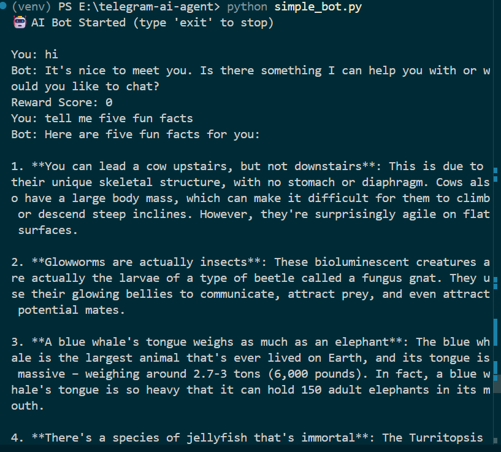
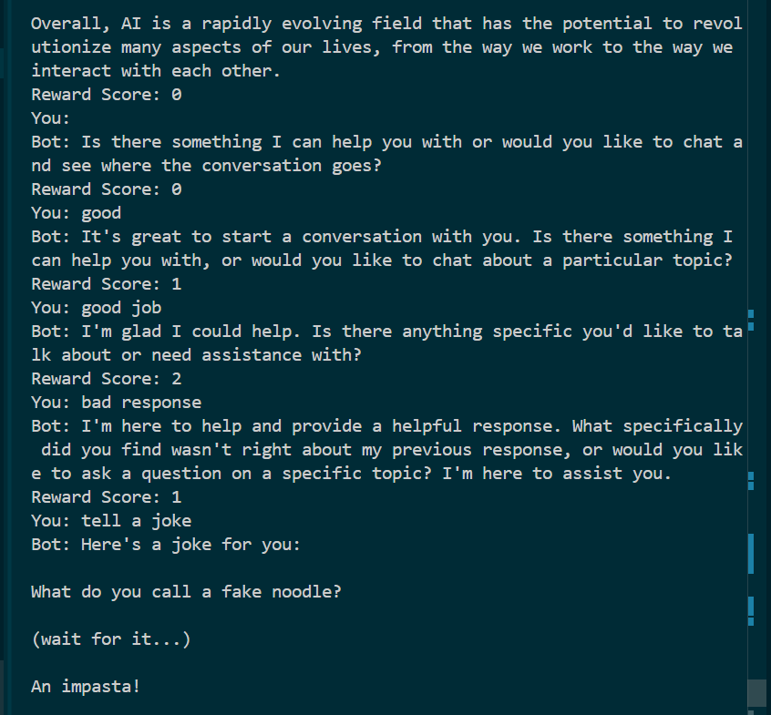
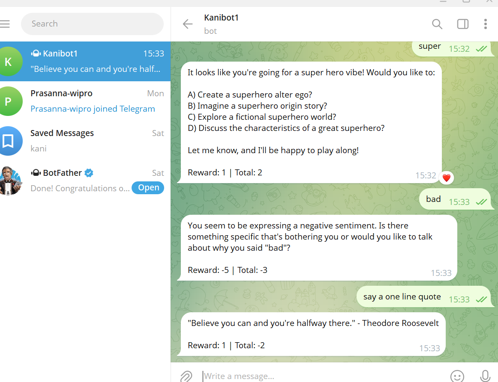

🤖 AI Bot Agent (Telegram + CLI)
📌 Overview

This project is a simple AI chatbot (agent) that responds to user input and simulates basic intelligent behavior using an AI model and a reward-based system.

It demonstrates how autonomous systems interact with users continuously.

🚀 Features
💬 AI-powered responses using Groq API (LLaMA 3.1)
📱 Telegram Bot integration
💻 CLI-based chatbot (terminal)
🔁 Continuous interaction (agent behavior)
🎯 Reward system (basic Reinforcement Learning concept)
🛠️ Tech Stack
Python
Groq API (llama-3.1-8b-instant)
Telegram Bot API
python-dotenv
📂 Project Structure
telegram-ai-agent/
│
├── bot.py              # Telegram bot
├── simple_bot.py       # CLI chatbot
├── .env                # API keys (not uploaded)
├── requirements.txt
├── README.md
└── screenshots/
⚙️ Setup Instructions
1. Clone the repository
git clone https://github.com/YOUR_USERNAME/ai-bot-agent.git
cd ai-bot-agent
2. Create virtual environment
python -m venv venv
venv\Scripts\activate
3. Install dependencies
pip install -r requirements.txt
4. Add environment variables

Create a .env file:

TELEGRAM_TOKEN=your_telegram_bot_token
GROQ_API_KEY=your_groq_api_key
▶️ Run the Bot
Run CLI Bot
python simple_bot.py
Run Telegram Bot
python bot.py
🧠 How It Works
User provides input
Input is sent to Groq API (LLaMA model)
AI generates a response
Bot displays the response
Reward system updates score based on user feedback
🎯 Reward System Logic
If user input contains "good" → reward +1
If user input contains "bad" → reward -1
Otherwise → reward remains unchanged
## 📸 Screenshots

### 🤖 AI Bot Response

### 🎯 Reward Check (CLI)

### 📱 Telegram Bot Response

### 🎯 Telegram Reward Check

Assignment Requirements Covered

✔ User input handling
✔ AI-generated responses
✔ Continuous agent loop
✔ Reward-based system (RL concept)
✔ Telegram bot implementation (bonus)

👨‍💻 Author

Kanmani N

This simulates a basic Reinforcement Learning concept.
