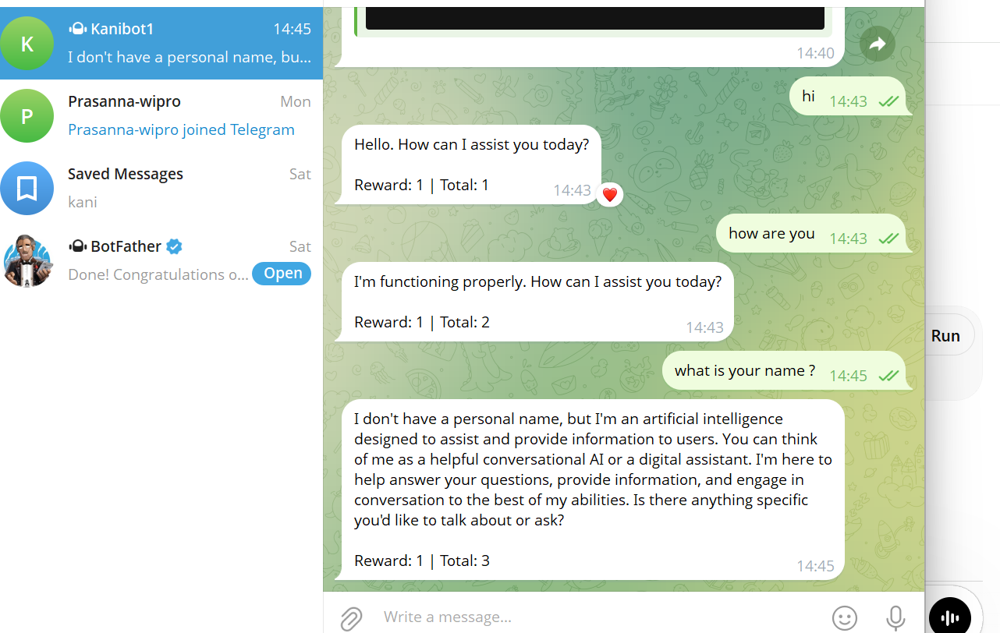

# 🤖 AI Bot Agent (Telegram + CLI)

## 📌 Overview
This project is a simple AI chatbot (agent) that responds to user input and simulates intelligent behavior using an AI model and a reward-based system.

It demonstrates how autonomous AI systems:
- Interact with users
- Generate responses
- Learn using basic reward logic

---

## 🚀 Features
- 💬 AI-powered responses using Groq API (LLaMA 3.1)
- 📱 Telegram Bot integration
- 💻 CLI-based chatbot (terminal)
- 🔁 Continuous interaction (agent loop)
- 🎯 Reward system (basic Reinforcement Learning concept)

---

## 🛠️ Tech Stack
- Python
- Groq API (`llama-3.1-8b-instant`)
- Telegram Bot API
- python-dotenv

---

## 📂 Project Structure
telegram-ai-agent/
│
├── bot.py # Telegram bot
├── simple_bot.py # CLI chatbot
├── .env # API keys (not uploaded)
├── requirements.txt
├── README.md
└── screenshots/

---

## ⚙️ Setup Instructions

### 1️⃣ Clone the repository
git clone https://github.com/Kani21-12/ai-bot-agent.git
cd ai-bot-agent

### 2️⃣ Create virtual environment
python -m venv venv
venv\Scripts\activate

### 3️⃣ Install dependencies
pip install -r requirements.txt

### 4️⃣ Add environment variables

Create a `.env` file:
TELEGRAM_TOKEN=your_telegram_bot_token
GROQ_API_KEY=your_groq_api_key

---

## ▶️ Run the Bot

### 💻 Run CLI Bot
python simple_bot.py

### 📱 Run Telegram Bot
python bot.py

---

## 🧠 How It Works

1. User enters input  
2. Input is sent to Groq API (LLaMA model)  
3. AI generates a response  
4. Bot replies to user  
5. Reward score updates based on feedback  

---

## 🎯 Reward System Logic

- If user input contains **"good"** → reward **+1**  
- If user input contains **"bad"** → reward **-1**  
- Otherwise → reward unchanged  

This simulates a simple Reinforcement Learning concept.

---

## 📸 Screenshots

### 🤖 AI Bot Response

### 🎯 Reward Check (CLI)

### 📱 Telegram Bot Response

### 🎯 Telegram Reward Check

---

## 📄 Assignment Requirements Covered

✔ User input handling  
✔ AI-generated responses  
✔ Continuous agent loop  
✔ Reward-based system (RL concept)  
✔ Telegram bot implementation (bonus)  

---

## 👨‍💻 Author
Kanmani N

---

## 🔐 Note
- `.env` file is excluded for security  
- API keys are kept private  

---

## ⭐ Future Improvements
- Memory-based conversations  
- Smarter reward learning  
- Voice input support  
- Cloud deployment  

---
